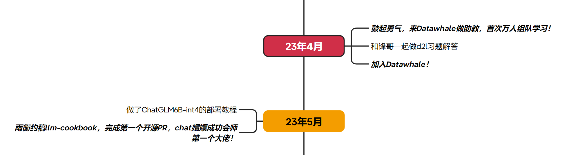
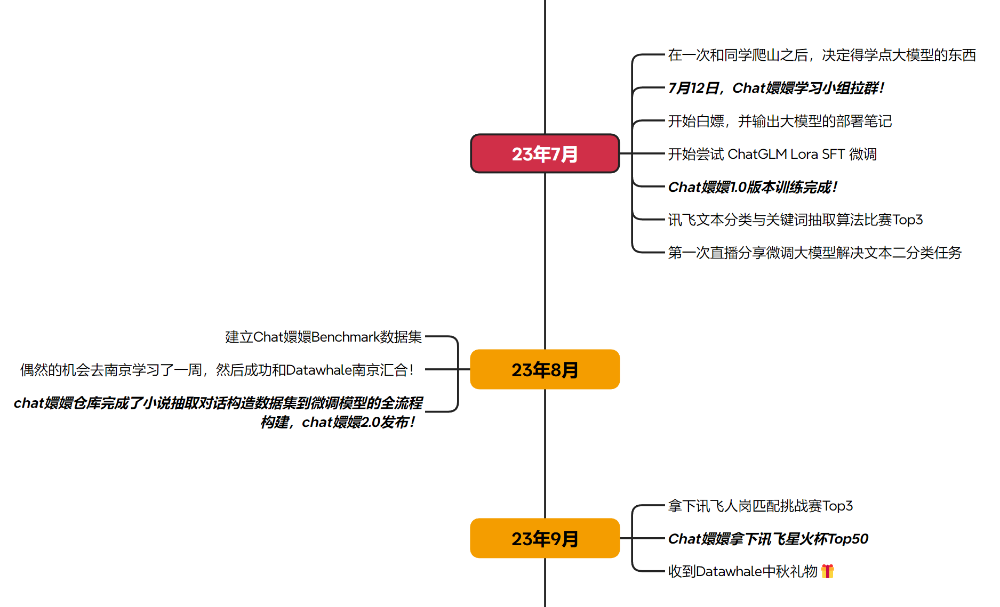
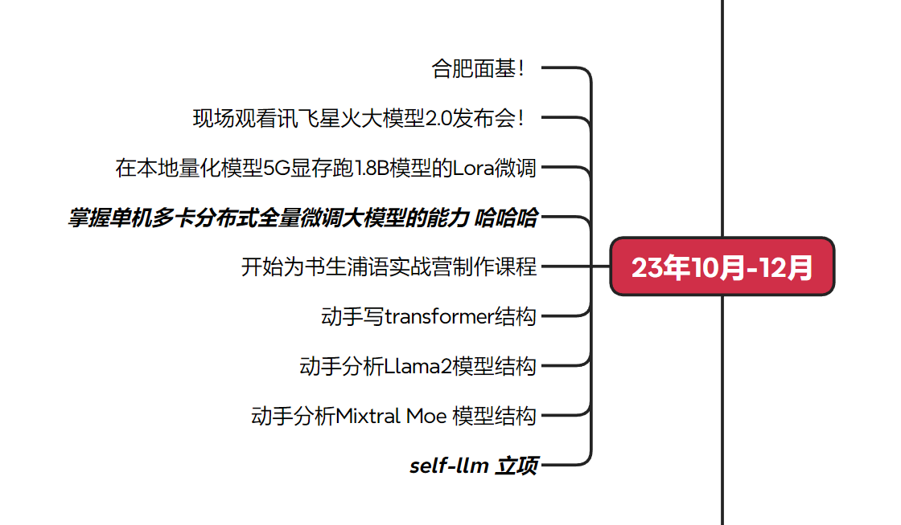
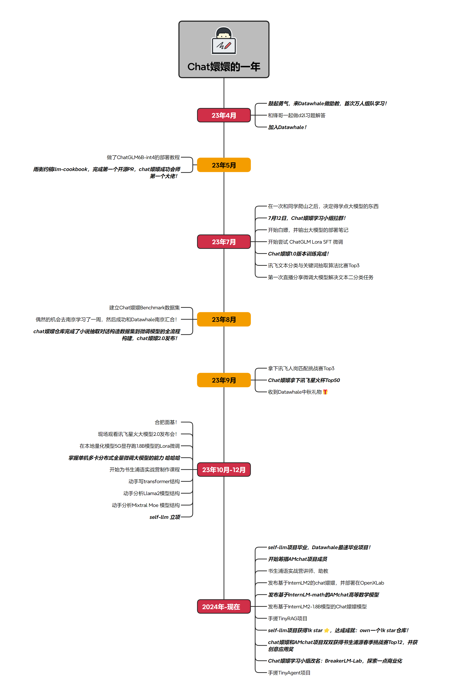

# 在datawhale的一年

大家好，我是宋志学，这个名字大家可能不太熟悉，换一个马甲。大家好，我是不要葱姜蒜，这下可能就有很多小伙伴认识我了，哈哈哈。从正式接触Datawhale到现在刚好一年，这一年中发生了很多故事，我想与大家分享一下其中的一些故事。

我其实很早就关注Datawhale公众号了，参加过几次组队学习，认真完成助教布置的学习任务，然后进入了“优秀学习者2群”，在这个群里摸鱼潜水了很久。直到去年的四月份，我看到了一条消息：“招募Datawhale动手学深度学习助教”。在去年三月份的时候，正好看过李沐老师这本书的前几章，所以我觉得我应该可以胜任助教的角色叭，于是鼓起勇气报名了助教。（此处应该就是梦开始的地方了）

报名之前，我不知道这是Datawhale尝试的第一次万人组队学习计划，做助
教期间做了一点动手学深度学习这本书的一些课后题。在锋哥的建议和鼓励下，我们把动手学的习题解答做成了一个开源项目，这也是我第一次使用github创建仓库吧。本来打算做完这个项目再申请加入Datawhale的，结果马姐姐在群里发了一个申请表，那我指定不能错过这个机会啊，在datawhale原神小队的鼎力支持下顺利加入！

去年五月，大模型刚开始火的时候，尝试在本地部署了一下ChatGLM-6B int4，并写了一篇部署的笔记。然后就是，第一个Chat嬛嬛项目的大佬！雨衡来找我约稿GLM Prompt教程，并以此为契机接触到了后续更多优秀的大佬，果然大佬都是一窝一窝的。七月初，在和朋友一起爬山的时候，我觉得我必须得学一点大模型的东西，然后回学校之后立马找到雨衡、王哥（王熠明）和杜哥（杜森）拉了一个Chat嬛嬛的学习小群。当时也是一拍即合啊，我们也没想到就是这样一个很巧合的事情，后续促成了更多的比赛和奖项，当时为嬛嬛项目设想的各种未来规划，目前也是基本都完成了。

7月的下半月煜神之前问了我两次要不要来Datawhale夏令营做助教，在此之前有幸参与过一次范大主持的Datawhale的腾讯会议，煜神也发言了，我感觉煜神看待事情的思路太清晰了，而且还可以完整的将自己的想法讲述出来。所以当煜神来问我要不要做夏令营助教的时候，是有点惊讶的，但由于暑假在完成导师布置的论文任务，所以就婉拒了两次，答应了最后一次一定来做助教。

说来也巧，我和雨衡一起做了夏令营NLP的助教，然后一起做了一个“Lora微调大模型解决文本二分类任务”的学习教程。然后突然发现这个大模型对于一般的NLP任务简直就是降维打击，乱拳打死老师傅啊。最后，和Chat嬛嬛小组的各位大佬一起顺手拿下了“讯飞文本分类与关键词抽取”算法比赛的Top3。初出茅庐未曾参加过比赛的我们，在看到比赛倒计时结束的时候，还是有点激动的。

八月，一次偶然的机会，我获得了去南京师范大学交流学习的机会。趁此机会，成功与Datawhale南京汇合，也终于见到了煜神和锋哥，还有戴总和耀晨。煜神很喜欢玩桌游，很遗憾没能去煜神家玩桌游，下次一定！接下来的九月，也是顺手和小伙伴们又拿了一个讯飞人岗匹配挑战赛Top3的奖项，Chat嬛嬛拿下讯飞星火杯Top50。这次再拿奖，内心的波动就不是很多了，哈哈哈~

去年最后的10月到12月，首先是合肥面基！因为拿了两个算法赛的Top3和一个星火杯Top50，所以Chat嬛嬛小组的所有成员基本都来到了合肥。落地就是Uno打牌！（打牌×，交流√）第一次看讯飞星火大模型发布会还是在宿舍中午没睡觉看的，第二次就直接到了现场，就是感觉很神奇，我一个学工科的怎么就到了科技发布会现场，哈哈哈。之后的茶话会，范大聊了很多关于Datawhale的未来规划，说实话，我从来没想过这么多，我只是现在Datawhale一边学习一边成长。Datawhale坚持做良性的商业循环，在这个贩卖焦虑、一舟遍地的时代，Datawhale的坚持显得尤为可贵。

我本以为23年的学习之旅会在合肥之后告一段落，没想到它还加速了。从合肥回去之后，首先在AWS机器上跑通了Deepspeed单机多卡全量微调大模型，掌握大模型的核心技巧！（自封的核心）在这之后和雨衡、长琴哥一起为书生·浦语实战营制作课程文档和录课。就是在这个录课的时候，想买轻薄本的想法达到了高潮（剧透：最后还是买了），每天背着五六斤的拯救者往返实验室和宿舍，我就是习武之人。然后在此期间补充关于大模型的基础知识，手写Attention和Transformer，动手分析transformers仓库的Llama2模型结构，正巧Mixtral moe模型发布，顺手也分析了一波moe的模型结构，写了很多笔记，都分享到了社区，有一些发布到Datawhale公众号。年末，self-llm项目在Datawhale立项，本来是在做InternLM模型部署的时候，写了一个简单的AutoDl部署笔记。后来拉雨衡讨论了一下，好像中文社区没有做的很好的大模型部署的教程，写都写了，不如全写！然后就有了Datawhale最速毕业项目：self-llm 开源大模型食用指南项目。

在元旦举行的Datawhale五周年年会上，我是最佳伯乐奖。我有点惊讶，因为我觉得我也没特意帮助谁啊，如果说谁是我的伯乐，那Datawhale应该是我的伯乐，在这里只要你有想学习的想法，就一定会有小伙伴和你一起前进。我想了一下，应该是我在学习的时候，不经意的时候就帮助了大家很多，无心插柳处，你也可以成为别人的伯乐。前提是你要好好学习，哈哈哈哈~

OK，今年，今年发生了什么呢？我觉得今年才更加激动人心！

- self-llm项目毕业，Datawhale最速毕业项目
- 筹措AMchat项目
- 书生·浦语实战营讲师、助教
- 发布基于InternLM2的Chat嬛嬛模型，并部署在OpenXLab
- 发布基于InternLM2-math的AMchat高等数学模型
- 为了学习RAG，手搓了TinyRAG项目
- self-llm项目获得1k star，达成成就：own 1k star 仓库！
- Chat嬛嬛和AMchat项目双双获得书生·浦源春季挑战赛Top12，并获得创意应用奖。
- Chat嬛嬛学习小组改名：BreakerLM-Lab，探索一点商业化
- 为了学习Agent，手搓了TinyAgent项目
- 等等...

仅仅过去了三个月，但却比去年一年学到的东西都多，大模型学习的旅途又开始加速了~

这就是加入Datawhale一年，我所学习和做过的事情。齿轮开始转动的地方就是：鼓起勇气，来Datawhale做助教。

所以，如果你也在犹豫不定，不知道如何学习，不如来Datawhale参与一期组队学习？学有余力的同学来做助教？哈哈哈，我是不要葱姜蒜，期待与大家一起学习！

