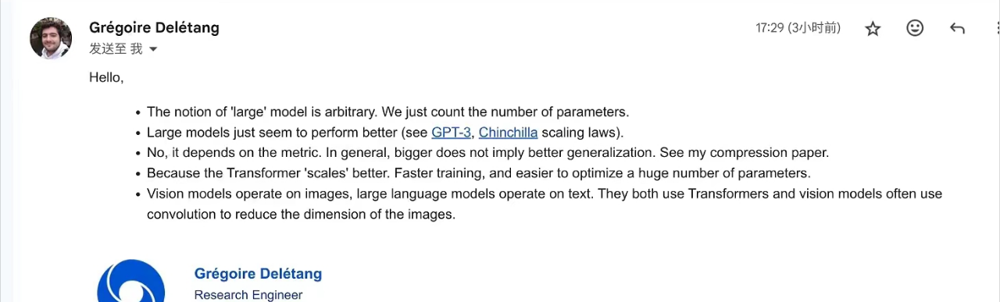
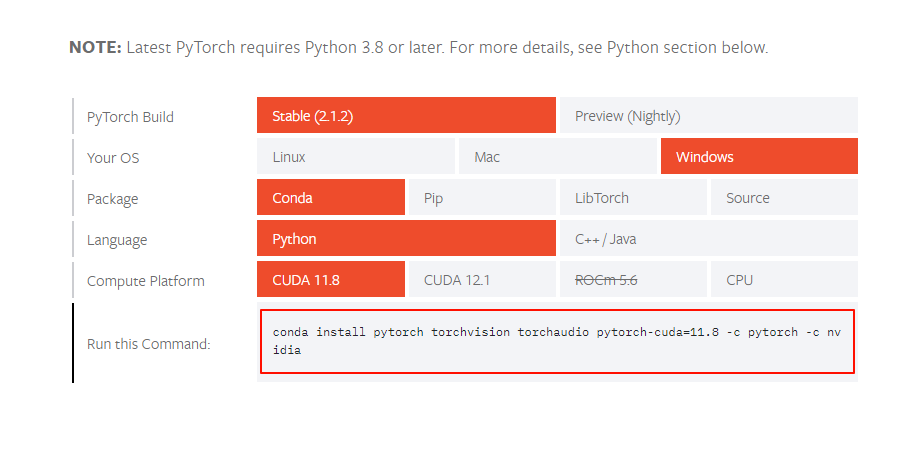
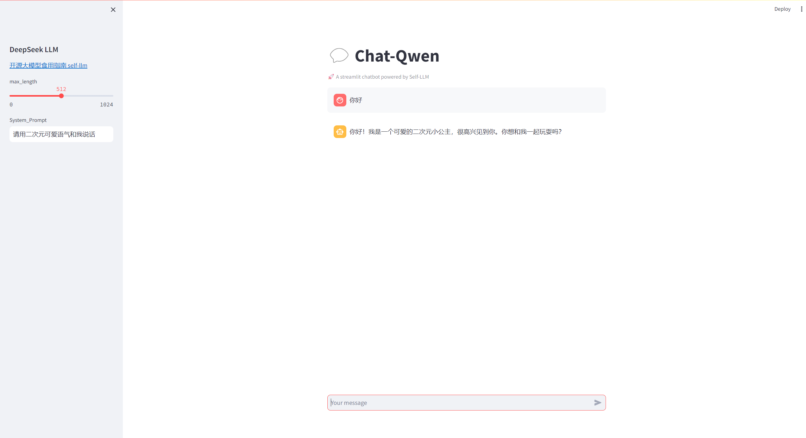

# 大模型介绍与部署

## 什么是大模型？

我一直以来也认为大模型就是参数量很大的模型，比如 chatgpt ，它的参数量就达到了175B(175B)。但阿里通义千问发布的模型 Qwen-1.8B 只有18亿参数，但是它的模型也被称为大模型。那使用了attention的结构的transformers结构的模型就认为是大模型的话，那bert也是大模型，显然我们不认为bert是大模型，而国内团队独创的 RWKV 大模型，使用的就是RNN结构。所以似乎现在我们也不能解释什么是大模型。

所以对于大模型的解释我也是比较疑惑的。幸好有个佬向 Google deepmind 的巨佬发了邮件问了下

1. 大模型怎么算大（只说参数量不让我信服）
2. 为什么现在的大模型才是好的大模型 
3. 大就一定好吗
4. 大语言模型为什么用 transformer架构 很少rnn 
5. 语言大模型和视觉大模型区别在哪?



这里是一些关于大模型的综述论文，有 Agent 也有 RAG ，感兴趣的朋友可以关注下。

复旦大模型 Agent 综述 ：https://github.com/WooooDyy/LLM-Agent-Paper-List.git

同济大模型 RAG 综述 ：https://arxiv.org/abs/2312.10997

## Windows 环境下部署大模型

好了，看过介绍，看过论文之后可以简单的在本地windows环境下简单体验一下大模型的魅力。

本笔记以 [Qwen-7b-chat](https://hf-mirror.com/Qwen/Qwen-7B-Chat) 模型为基础进行部署，由于我本地只有 6G 显存，所以我就部署了 [Qwen-1.8B-chat](https://hf-mirror.com/Qwen/Qwen-1_8B-Chat) 模型，如果有 24G 的显存，就可以选择 [Qwen-7b-chat](https://hf-mirror.com/Qwen/Qwen-7B-Chat) 模型。

## 环境配置

首先我们需要安装 pytorch ，前提是需要安装 conda 环境。为什么选择 conda 环境？在conda 环境下安装torch只需要一行代码，而且可以直接在虚拟环境中安装cuda依赖，并且使用conda安装cuda依赖，在当虚拟环境中它的优先级是最高的，也就是说不会和系统环境中的cuda依赖冲突。

首先安装 miniconda ，下载地址：https://mirrors.tuna.tsinghua.edu.cn/anaconda/miniconda/ ，选择一个喜欢的版本下载即可。选择 miniconda 是因为 anaconda 体积太大了，咱们不需要那么多的包，只需要安装 miniconda 就行了。 miniconda 和 anaconda 使用起来没有任何区别。

### 配置镜像源

miniconda 安装好了之后，我们需要配置清华源，因为清华源的下载速度比较快，而且国内的网络环境也不是很好，所以我们需要配置清华源。

> 注意：此过程需要在Windows的 Power shell 终端下进行，不要使用 cmd 终端，因为 cmd 终端不支持 conda 命令。

- 配置 pip 镜像源

这里使用的是清华镜像源。

```shell
# 先升级 pip
python -m pip install --upgrade pip
pip config set global.index-url https://mirrors.tuna.tsinghua.edu.cn/pypi/web/simple
```

- 配置 conda 镜像源

Windows 用户无法直接创建名为 `.condarc` 的文件，可先执行 `conda config --set show_channel_urls yes` 生成该文件之后再修改。

可以找到刚刚生成的`.condarc`文件，文件就在 `Windows:C:\Users\<YourUserName>\.condarc`，在文件中放入以下内容：

```shell
channels:
  - defaults
show_channel_urls: true
default_channels:
  - https://mirrors.tuna.tsinghua.edu.cn/anaconda/pkgs/main
  - https://mirrors.tuna.tsinghua.edu.cn/anaconda/pkgs/r
  - https://mirrors.tuna.tsinghua.edu.cn/anaconda/pkgs/msys2
custom_channels:
  conda-forge: https://mirrors.tuna.tsinghua.edu.cn/anaconda/cloud
  pytorch: https://mirrors.tuna.tsinghua.edu.cn/anaconda/cloud
```

> 如有问题可以查看镜像网站：https://help.mirrors.cernet.edu.cn/

## 安装 pytorch

使用 `nvidia-smi` 命令在终端中查看自己的显卡驱动支持的最高CUDA版本。这里可以看到我的驱动最高支持12.0版本的CUDA。

```shell
PS C:\Users\10213> nvidia-smi
Sun Dec 24 20:44:30 2023
+-----------------------------------------------------------------------------+
| NVIDIA-SMI 528.49       Driver Version: 528.49       CUDA Version: 12.0     |
|-------------------------------+----------------------+----------------------+
| GPU  Name            TCC/WDDM | Bus-Id        Disp.A | Volatile Uncorr. ECC |
| Fan  Temp  Perf  Pwr:Usage/Cap|         Memory-Usage | GPU-Util  Compute M. |
|                               |                      |               MIG M. |
|===============================+======================+======================|
|   0  NVIDIA GeForce ... WDDM  | 00000000:01:00.0  On |                  N/A |
| N/A   44C    P8    15W /  95W |   1446MiB /  6144MiB |      2%      Default |
|                               |                      |                  N/A |
+-------------------------------+----------------------+----------------------+
```

首先创建一个虚拟环境，这里我创建了一个名为 `nlp-llm` 的虚拟环境。

```shell
conda create --name nlp-llm python=3.10 -y
```

然后激活环境：

```shell
conda activate nlp-llm
```

打开 pytorch 官网：https://pytorch.org/get-started/locally/ ，安装torch的时候，需要选一个低于你电脑支持的最高的CUDA版本，这里我选择了 11.8 版本。



然后复制下面的代码到终端中，就可以安装 pytorch 了。

```shell
conda install pytorch torchvision torchaudio pytorch-cuda=11.8 -c pytorch -c nvidia
```

## 安装其他依赖

ok，pytorch安装好了，我们还需要安装其他的依赖，这里我直接使用了清华源的镜像，速度比较快。比如transformers等等。

```shell
pip install modelscope==1.9.5
pip install fastapi==0.104.1
pip install uvicorn==0.24.0
pip install requests==2.25.1
pip install modelscope==1.9.5
pip install transformers==4.35.2
pip install streamlit==1.24.0
pip install sentencepiece==0.1.99
pip install accelerate==0.24.1
pip install transformers_stream_generator==0.0.4
```

## 模型下载

使用 `modelscope` 中的 `snapshot_download` 函数下载模型，第一个参数为模型名称，参数`cache_dir` 为模型的下载路径。

> 什么是 ModelScope ？ModelScopes是阿里巴巴的一个项目，它可以帮助我们下载模型，查看模型的参数量，模型的大小等等。它的官网地址为：https://www.modelscope.cn/models ，可以在官网上查看更多的模型信息。modelscope和hugging face上的模型是一样的。

在 `/root/autodl-tmp` 路径下新建 `download.py` 文件并在其中输入以下内容，粘贴代码后记得保存文件，如下图所示。并运行 `python download.py` 执行下载，模型大小为 `15 GB`，下载模型大概需要10~20分钟

```python
from modelscope import snapshot_download, AutoModel, AutoTokenizer
model_dir = snapshot_download('qwen/Qwen-7B-Chat', cache_dir='/root/autodl-tmp', revision='v1.1.4')
```

## web_demo 运行

新建 `chatBot.py` 文件并在其中输入以下内容，粘贴代码后记得保存文件。下面的代码有很详细的注释。

修改以下代码的 `mode_name_or_path` 。然后运行代码：

```shell
streamlit run chatBot.py
```

```python
# 导入所需的库
from transformers import AutoTokenizer, AutoModelForCausalLM, GenerationConfig
import torch
import streamlit as st

# 在侧边栏中创建一个标题和一个链接
with st.sidebar:
    st.markdown("## DeepSeek LLM")
    "[开源大模型食用指南 self-llm](https://github.com/datawhalechina/self-llm.git)"
    # 创建一个滑块，用于选择最大长度，范围在0到1024之间，默认值为512
    max_length = st.slider("max_length", 0, 1024, 512, step=1)
    system_prompt = st.text_input("System_Prompt", "")

# 创建一个标题和一个副标题
st.title("💬 Chat-Qwen")
st.caption("🚀 A streamlit chatbot powered by Self-LLM")

# 定义模型路径
mode_name_or_path = 'your model path'

# 定义一个函数，用于获取模型和tokenizer
@st.cache_resource
def get_model():
    # 从预训练的模型中获取tokenizer
    tokenizer = AutoTokenizer.from_pretrained(mode_name_or_path, trust_remote_code=True)
    # 从预训练的模型中获取模型，并设置模型参数
    model = AutoModelForCausalLM.from_pretrained(mode_name_or_path, device_map='auto', torch_dtype=torch.bfloat16, trust_remote_code=True).eval()
    # Specify hyperparameters for generation
    model.generation_config = GenerationConfig.from_pretrained(mode_name_or_path, trust_remote_code=True) # 可指定不同的生成长度、top_p等相关超参
    # 设置模型为评估模式
    model.eval()  
    return tokenizer, model

# 加载Chatglm3的model和tokenizer
tokenizer, model = get_model()

# 如果session_state中没有"messages"，则创建一个包含默认消息的列表
if "messages" not in st.session_state:
    st.session_state["messages"] = []

# 遍历session_state中的所有消息，并显示在聊天界面上
for msg in st.session_state.messages:
    st.chat_message("user").write(msg[0])
    st.chat_message("assistant").write(msg[1])

# 如果用户在聊天输入框中输入了内容，则执行以下操作
if prompt := st.chat_input():
    # 在聊天界面上显示用户的输入
    st.chat_message("user").write(prompt)
    # 构建输入     
    response, history = model.chat(tokenizer, prompt, system=system_prompt, history=st.session_state.messages)
    # 将模型的输出添加到session_state中的messages列表中
    st.session_state.messages.append((prompt, response))
    # 在聊天界面上显示模型的输出
    st.chat_message("assistant").write(response)
```



## 关于微调

后续更新~

可以关注 开源大模型食用教程：https://github.com/datawhalechina/self-llm.git

## 大模型相关 blog

- 开源大模型食用教程：https://github.com/datawhalechina/self-llm.git
- 动手学大模型应用开发：https://github.com/datawhalechina/llm-universe.git
- 面向开发者的 LLM 入门课程：https://github.com/datawhalechina/prompt-engineering-for-developers.git
- 微调ChatGLM2-6B解决文本二分类问题：https://vj6fpcxa05.feishu.cn/docx/DIged2HfIojIYlxWP9Hc2x0UnVd
- 深入浅出 LoRA：https://zhuanlan.zhihu.com/p/650197598
