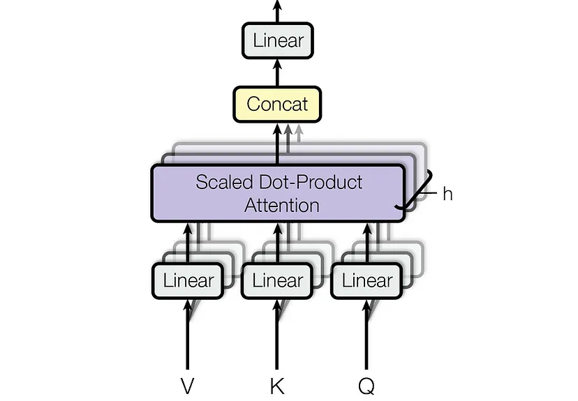
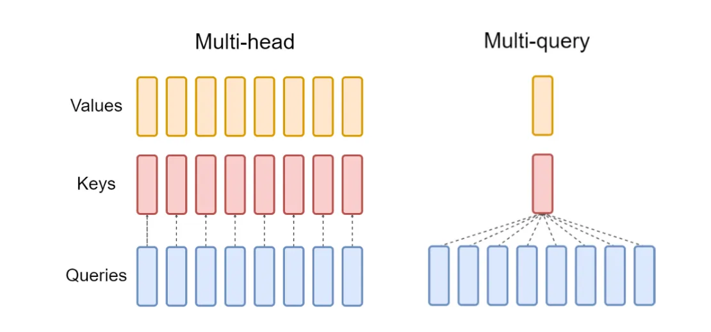
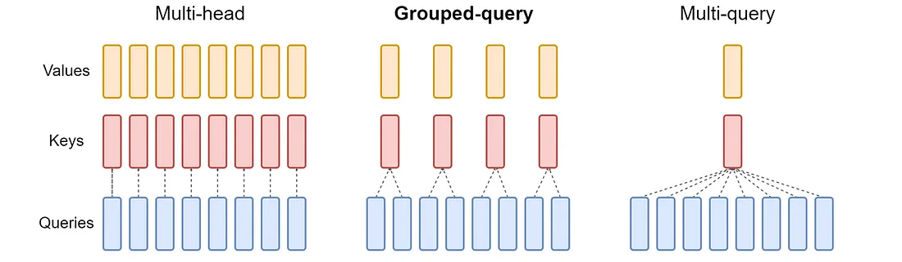
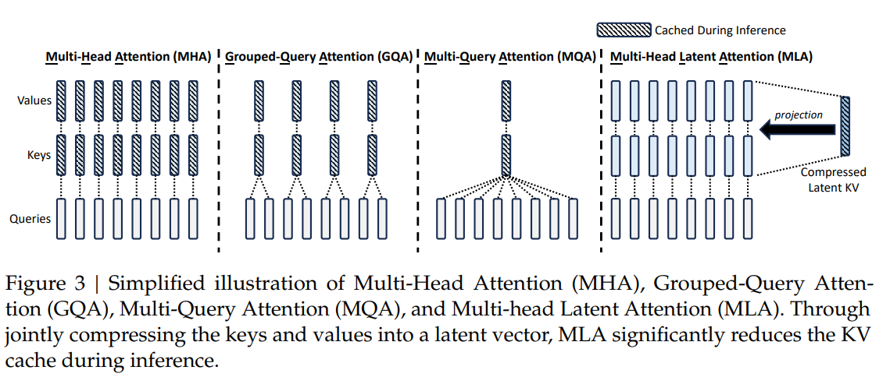

# Attention 之 MHA、MQA、GQA、MLA

## 多头注意力机制（Multi-Head Attention，MHA）

多头注意力（Multi-Head Attention, MHA）是Transformer模型的核心机制，通过并行计算多个注意力头，使模型能够同时关注输入序列中不同位置的特征。其核心思想是将输入映射到多个子空间，分别计算注意力权重并聚合结果，从而增强模型对复杂模式的捕捉能力。



**第一阶段：线性变换与多头拆分**  
输入序列 $X \in \mathbb{R}^{B \times L \times D}$（批大小 $B$，序列长度 $L$，特征维度 $D$）通过可学习参数生成查询（Query）、键（Key）、值（Value）： 

$$
Q = XW_Q,\quad K = XK_K,\quad V = XV \quad \text{其中} \ W_Q, W_K, W_V \in \mathbb{R}^{D \times D}
$$ 

随后，将 $Q, K, V$ 拆分为 $h$ 个头，每个头的维度为 $d_k = D/h$，并调整形状为： 

$$
Q_h = Q \cdot W_{Q,h} \in \mathbb{R}^{B \times h \times L \times d_k}
$$  


**第二阶段：缩放点积注意力**  
每个头独立计算注意力权重：  

$$
\text{Attention}(Q_h, K_h, V_h) = \text{softmax}\left( \frac{Q_h K_h^T}{\sqrt{d_k}} \right)V_h
$$  

其中 $\frac{Q_h K_h^T}{\sqrt{d_k}} \in \mathbb{R}^{B \times h \times L \times L}$ 表示查询与键的相似度矩阵，缩放因子 $\sqrt{d_k}$ 缓解点积过大导致的梯度消失。若存在掩码（如屏蔽填充位置），则对无效位置填充$-\infty$。

**第三阶段：多头合并与输出投影**  
将所有头的输出拼接并映射回原始维度：  

$$
\text{Concat}(head_1, ..., head_h) \in \mathbb{R}^{B \times L \times D},\quad \text{Output} = \text{Concat} \cdot W_O
$$  

代码实现如下：

```python
import torch
import torch.nn as nn

class MultiHeadAttention(nn.Module):
    def __init__(self, hidden_size, num_heads, dropout=0.0):
        """
        多头注意力机制的实现。

        Args:
            hidden_size (int): 输入特征的维度，也即 hidden_state 的最后一维。
            num_heads (int): 注意力头的数量。
            dropout (float): dropout 的概率，默认为 0.0。
        """
        super(MultiHeadAttention, self).__init__()
        
        assert hidden_size % num_heads == 0, "hidden_size 必须能被 num_heads 整除"

        self.hidden_size = hidden_size
        self.num_heads = num_heads
        self.head_dim = hidden_size // num_heads  # 每个头的维度

        # 定义线性变换层，用于生成 Q, K, V
        self.query = nn.Linear(hidden_size, hidden_size)
        self.key = nn.Linear(hidden_size, hidden_size)
        self.value = nn.Linear(hidden_size, hidden_size)

        self.dropout = nn.Dropout(dropout)
        
        # 输出线性层
        self.out_projection = nn.Linear(hidden_size, hidden_size)

    def forward(self, hidden_state, attention_mask=None):
        """
        前向传播函数。

        Args:
            hidden_state (torch.Tensor): 输入的 hidden_state，形状为 [batch_size, seq_len, hidden_size]。
            attention_mask (torch.Tensor, optional): 注意力掩码，用于屏蔽某些位置，形状为 [batch_size, seq_len]。默认为 None。

        Returns:
            torch.Tensor: 注意力输出，形状为 [batch_size, seq_len, hidden_size]。
        """
        batch_size, seq_len, _ = hidden_state.size()

        # 1. 通过线性层得到 Q, K, V
        query = self.query(hidden_state)  # [batch_size, seq_len, hidden_size]
        key = self.key(hidden_state)      # [batch_size, seq_len, hidden_size]
        value = self.value(hidden_state)    # [batch_size, seq_len, hidden_size]

        # 2. 将 Q, K, V 拆分成多头
        query = query.view(batch_size, seq_len, self.num_heads, self.head_dim).transpose(1, 2)  # [batch_size, num_heads, seq_len, head_dim]
        key = key.view(batch_size, seq_len, self.num_heads, self.head_dim).transpose(1, 2)      # [batch_size, num_heads, seq_len, head_dim]
        value = value.view(batch_size, seq_len, self.num_heads, self.head_dim).transpose(1, 2)    # [batch_size, num_heads, seq_len, head_dim]

        # 3. 计算注意力权重
        attention_weights = torch.matmul(query, key.transpose(-2, -1)) / (self.head_dim ** 0.5)  # [batch_size, num_heads, seq_len, seq_len]

        # 应用 attention mask
        if attention_mask is not None:
            attention_weights = attention_weights.masked_fill(attention_mask[:, None, None, :] == 0, float('-inf'))

        attention_weights = torch.softmax(attention_weights, dim=-1)  # [batch_size, num_heads, seq_len, seq_len]
        attention_weights = self.dropout(attention_weights)

        # 4. 计算上下文向量
        context = torch.matmul(attention_weights, value)  # [batch_size, num_heads, seq_len, head_dim]

        # 5. 将多头合并
        context = context.transpose(1, 2).contiguous().view(batch_size, seq_len, self.hidden_size)  # [batch_size, seq_len, hidden_size]

        # 6. 通过输出线性层
        output = self.out_projection(context)  # [batch_size, seq_len, hidden_size]

        return output

if __name__ == '__main__':
    # 示例
    batch_size = 2
    seq_len = 10
    hidden_size = 256
    num_heads = 8

    # 创建一个 MHA 实例
    mha = MultiHeadAttention(hidden_size, num_heads)

    # 创建一个随机的 hidden_state
    hidden_state = torch.randn(batch_size, seq_len, hidden_size)

    # 创建一个 attention mask (可选)
    attention_mask = torch.ones(batch_size, seq_len)
    attention_mask[:, 5:] = 0  # 屏蔽掉每个 batch 中 seq_len 的后 5 个位置

    # 通过 MHA 层
    output = mha(hidden_state, attention_mask)

    # 打印输出形状
    print("输出形状:", output.shape)  # torch.Size([2, 10, 256])
```

## 多查询注意力机制（Multi-Query Attention，MQA）

Multi-Query Attention (MQA) 是对多头注意力（MHA）的高效改进版本，其核心思想是**共享键（Key）和值（Value）的投影参数**，仅对查询（Query）使用独立的头参数。这种方法显著减少了模型参数量和计算复杂度，同时保留了多头注意力的部分并行性优势。



**第一阶段：参数共享的线性变换**

输入序列 $X \in \mathbb{R}^{B \times L \times D}$ 通过以下线性变换生成 Query、共享的 Key 和 Value：  

$$
Q = XW_Q \in \mathbb{R}^{B \times L \times D},\quad K = XW_K \in \mathbb{R}^{B \times L \times d_k},\quad V = XW_V \in \mathbb{R}^{B \times L \times d_k}
$$  

其中 $W_Q \in \mathbb{R}^{D \times D}$ 是每个头独立的查询参数，而 $W_K, W_V \in \mathbb{R}^{D \times d_k}$ 是所有头共享的键和值参数（$d_k = D/h$）。与 MHA 不同，MQA 的 Key 和 Value 投影参数在头间共享，参数量减少 $h-1$ 倍。


**第二阶段：多头注意力计算**

Query 被拆分为 $h$ 个头（形状调整为 $B \times h \times L \times d_k$），而 Key 和 Value 通过 `unsqueeze` 和 `expand` 扩展为 $B \times h \times L \times d_k$，实现所有头共享相同的 Key/Value。注意力权重计算为：

$$
\text{Attention}_h = \text{softmax}\left( \frac{Q_h K^T}{\sqrt{d_k}} \right)V \quad \text{（每个头独立计算）}
$$  

其中 $Q_h$ 是第 $h$ 个头的 Query，而 $K$ 和 $V$ 为共享的全局矩阵。此步骤保留了多头的并行性，但减少了 Key/Value 的冗余计算。

**第三阶段：输出投影与优化**

将所有头的输出拼接并通过输出投影层： 

$$
\text{Output} = \text{Concat}(\text{Attention}_1, ..., \text{Attention}_h) W_O \in \mathbb{R}^{B \times L \times D}
$$ 

由于 Key/Value 共享，MQA 的总参数量为 $ D^2 + 2D \cdot d_k $，远小于 MHA 的 $ 3D^2 $（当 $ h \gg 1 $ 时）。这种设计在保持序列建模能力的同时，降低了显存占用和计算延迟，适合大规模模型部署。

代码实现如下：

```python
import torch
import torch.nn as nn
from thop import profile 

class MultiQueryAttention(nn.Module):
    def __init__(self, hidden_size, num_heads, dropout=0.0):
        """
        Multi-Query Attention 的实现。

        Args:
            hidden_size (int): 输入特征的维度，也即 hidden_state 的最后一维。
            num_heads (int): 注意力头的数量。
            dropout (float): dropout 的概率，默认为 0.0。
        """
        super(MultiQueryAttention, self).__init__()
        
        assert hidden_size % num_heads == 0, "hidden_size 必须能被 num_heads 整除"

        self.hidden_size = hidden_size
        self.num_heads = num_heads
        self.head_dim = hidden_size // num_heads  # 每个头的维度

        # 定义线性变换层，用于生成 Q, K, V
        self.query = nn.Linear(hidden_size, hidden_size)  # 每个头独立的 Query
        self.key = nn.Linear(hidden_size, self.head_dim)  # 所有头共享的 Key
        self.value = nn.Linear(hidden_size, self.head_dim)  # 所有头共享的 Value

        self.dropout = nn.Dropout(dropout)
        self.out_projection = nn.Linear(hidden_size, hidden_size)

    def forward(self, hidden_state, attention_mask=None):
        """
        前向传播函数。

        Args:
            hidden_state (torch.Tensor): 输入的 hidden_state，形状为 [batch_size, seq_len, hidden_size]。
            attention_mask (torch.Tensor, optional): 注意力掩码，用于屏蔽某些位置，形状为 [batch_size, seq_len]。默认为 None。

        Returns:
            torch.Tensor: 注意力输出，形状为 [batch_size, seq_len, hidden_size]。
        """
        batch_size, seq_len, _ = hidden_state.size()

        # 1. 通过线性层得到 Q, K, V
        query = self.query(hidden_state)  # [batch_size, seq_len, hidden_size]
        key = self.key(hidden_state)      # [batch_size, seq_len, head_dim]
        value = self.value(hidden_state)  # [batch_size, seq_len, head_dim]

        # 2. 将 Q 拆分为多头
        query = query.view(batch_size, seq_len, self.num_heads, self.head_dim).transpose(1, 2)  # [batch_size, num_heads, seq_len, head_dim]

        # 3. 扩展 K 和 V 到 num_heads 维度（所有头共享相同的 K/V）
        key = key.unsqueeze(1).expand(-1, self.num_heads, -1, -1)  # [batch_size, num_heads, seq_len, head_dim]
        value = value.unsqueeze(1).expand(-1, self.num_heads, -1, -1)  # [batch_size, num_heads, seq_len, head_dim]

        # 4. 计算注意力权重
        attention_weights = torch.matmul(query, key.transpose(-2, -1)) / (self.head_dim ** 0.5)  # [batch_size, num_heads, seq_len, seq_len]

        # 应用 attention mask
        if attention_mask is not None:
            attention_weights = attention_weights.masked_fill(attention_mask[:, None, None, :] == 0, float('-inf'))

        attention_weights = torch.softmax(attention_weights, dim=-1)  # [batch_size, num_heads, seq_len, seq_len]
        attention_weights = self.dropout(attention_weights)

        # 5. 计算上下文向量
        context = torch.matmul(attention_weights, value)  # [batch_size, num_heads, seq_len, head_dim]

        # 6. 将多头合并
        context = context.transpose(1, 2).contiguous().view(batch_size, seq_len, self.hidden_size)  # [batch_size, seq_len, hidden_size]

        # 7. 通过输出线性层
        output = self.out_projection(context)  # [batch_size, seq_len, hidden_size]

        return output


if __name__ == '__main__':
    # 示例
    batch_size = 2
    seq_len = 10
    hidden_size = 256
    num_heads = 8

    # 创建一个 MQA 实例
    mqa = MultiQueryAttention(hidden_size, num_heads)

    # 创建一个随机的 hidden_state
    hidden_state = torch.randn(batch_size, seq_len, hidden_size)

    # 创建一个 attention mask (可选)
    attention_mask = torch.ones(batch_size, seq_len)
    attention_mask[:, 5:] = 0  # 屏蔽掉每个 batch 中 seq_len 的后 5 个位置

    # 通过 MQA 层
    output = mqa(hidden_state, attention_mask)

    # 打印输出形状
    print("输出形状:", output.shape)  # torch.Size([2, 10, 256])
```

## 分组查询注意力机制（Grouped Query Attention，GQA）

**Grouped Query Attention (GQA)** 是对多头注意力（MHA）和多查询注意力（MQA）的折中优化方案。其核心思想是将查询头（Query Heads）划分为多个组（Group），每组内的查询头共享一组键（Key）和值（Value），从而在保留多头并行性的同时减少参数量和计算复杂度。GQA 在参数效率与模型性能之间取得了平衡，适用于大规模模型的高效部署。



**第一阶段：分组线性变换**

输入序列 $X \in \mathbb{R}^{B \times L \times D}$（批大小 $B$，序列长度 $L$，特征维度 $D$）通过以下线性变换生成 Query、分组共享的 Key 和 Value：  

$$
Q = XW_Q \in \mathbb{R}^{B \times L \times D},\quad K = XW_K \in \mathbb{R}^{B \times L \times (G \cdot d_k)},\quad V = XW_V \in \mathbb{R}^{B \times L \times (G \cdot d_k)}
$$  

其中 $W_Q \in \mathbb{R}^{D \times D}$ 是每个查询头独立的参数，$G = \text{group\_num} = h/g$ 为组数（$h$ 为总头数，$g$ 为每组头数），$d_k = D/h$ 为每个头的维度。Key 和 Value 的投影参数按组划分，每组参数共享。


**第二阶段：分组注意力计算**

Query 被拆分为 $h$ 个头（形状调整为 $B \times h \times L \times d_k$），而 Key 和 Value 被拆分为 $G$ 组（每组包含 $g$ 个头共享的 Key/Value）。通过 `unsqueeze` 和 `expand` 操作，将每组 Key/Value 扩展到 $g$ 个头，形成 $B \times h \times L \times d_k$ 的结构。注意力权重计算为： 

$$
\text{Attention}_h = \text{softmax}\left( \frac{Q_h K_g^T}{\sqrt{d_k}} \right)V_g \quad \text{（每个头 } h \text{ 所属组 } g \text{ 共享 } K_g, V_g \text{）}
$$  

其中 $Q_h$ 是第 $h$ 个查询头，$K_g$ 和 $V_g$ 是其所属组 $g$ 的共享键和值。此设计使同一组内的查询头关注相同子空间，而不同组可学习不同的特征模式。


**第三阶段：输出投影与参数优化**

将所有头的输出拼接并通过输出投影层：

$$
\text{Output} = \text{Concat}(\text{Attention}_1, ..., \text{Attention}_h) W_O \in \mathbb{R}^{B \times L \times D}
$$ 

由于每组 Key/Value 被 $g$ 个头共享，GQA 的总参数量为 $D^2 + 2D \cdot (G \cdot d_k) = D^2 + 2D \cdot (D/g)$，显著低于 MHA 的 $3D^2$（当 $g > 1$ 时）。这种设计在保持多头多样性的前提下，减少了显存占用和计算延迟，适合长序列建模和大规模模型部署。


代码实现如下：

```python
import torch
import torch.nn as nn

class GroupedQueryAttention(nn.Module):
    def __init__(self, hidden_size, num_heads, group_size=2, dropout=0.0):
        """
        Grouped Query Attention 实现。

        Args:
            hidden_size (int): 输入特征的维度。
            num_heads (int): 查询头的数量。
            group_size (int): 每个组中包含的查询头数量。
            dropout (float): dropout 的概率。
        """
        super(GroupedQueryAttention, self).__init__()
        assert hidden_size % num_heads == 0, "hidden_size 必须能被 num_heads 整除"
        assert num_heads % group_size == 0, "num_heads 必须能被 group_size 整除"

        self.hidden_size = hidden_size
        self.num_heads = num_heads
        self.group_size = group_size
        self.group_num = num_heads // group_size
        self.head_dim = hidden_size // num_heads 

        # 查询头
        self.query = nn.Linear(hidden_size, hidden_size)
        # 键和值头（分组共享）
        self.key = nn.Linear(hidden_size, self.group_num * self.head_dim)
        self.value = nn.Linear(hidden_size, self.group_num * self.head_dim)

        self.dropout = nn.Dropout(dropout)
        self.out_projection = nn.Linear(hidden_size, hidden_size)

    def forward(self, hidden_state, attention_mask=None):
        """
        前向传播函数。

        Args:
            hidden_state (torch.Tensor): 输入张量，形状为 [batch_size, seq_len, hidden_size]。
            attention_mask (torch.Tensor, optional): 注意力掩码，形状为 [batch_size, seq_len]。

        Returns:
            torch.Tensor: 注意力输出，形状为 [batch_size, seq_len, hidden_size]。
        """
        batch_size, seq_len, _ = hidden_state.size()

        # 1. 通过线性层生成 Q, K, V
        query = self.query(hidden_state)  # [batch_size, seq_len, hidden_size]
        key = self.key(hidden_state)      # [batch_size, seq_len, group_num * head_dim]
        value = self.value(hidden_state)  # [batch_size, seq_len, group_num * head_dim]

        # 2. 将 Q, K, V 拆分成多头
        query = query.view(batch_size, seq_len, self.num_heads, self.head_dim).transpose(1, 2)  # [batch_size, num_heads, seq_len, head_dim]

        # K 和 V 扩展到 num_heads 个头
        key = key.view(batch_size, seq_len, self.group_num, self.head_dim).transpose(1, 2)  # [batch_size, group_num, seq_len, head_dim]
        key = key.unsqueeze(2).expand(-1, -1, self.group_size, -1, -1).contiguous().view(batch_size, -1, seq_len, self.head_dim)  # [batch_size, num_heads, seq_len, head_dim]

        value = value.view(batch_size, seq_len, self.group_num, self.head_dim).transpose(1, 2)  # [batch_size, group_num, seq_len, head_dim]
        value = value.unsqueeze(2).expand(-1, -1, self.group_size, -1, -1).contiguous().view(batch_size, -1, seq_len, self.head_dim)  # [batch_size, num_heads, seq_len, head_dim]

        # 3. 计算注意力权重
        attention_weights = torch.matmul(query, key.transpose(-2, -1)) / (self.head_dim ** 0.5)

        if attention_mask is not None:
            attention_weights = attention_weights.masked_fill(attention_mask[:, None, None, :] == 0, float('-inf'))

        attention_weights = torch.softmax(attention_weights, dim=-1)
        attention_weights = self.dropout(attention_weights)

        # 4. 计算上下文向量
        context = torch.matmul(attention_weights, value)

        # 5. 合并多头
        context = context.transpose(1, 2).contiguous().view(batch_size, seq_len, self.hidden_size)

        # 6. 输出投影
        output = self.out_projection(context)

        return output

# 示例
if __name__ == '__main__':
    batch_size = 2
    seq_len = 10
    hidden_size = 256
    num_heads = 8
    group_size = 2  # 每组 2 个头，共 4 组

    gqa = GroupedQueryAttention(hidden_size, num_heads, group_size)
    hidden_state = torch.randn(batch_size, seq_len, hidden_size)
    attention_mask = torch.ones(batch_size, seq_len)
    attention_mask[:, 5:] = 0  # 屏蔽后 5 个位置

    output = gqa(hidden_state, attention_mask)
    print("输出形状:", output.shape)  # torch.Size([2, 10, 256])
```

## 多头潜在注意力（Multi-Head Latent Attention, MLA）

**Multi-Head Latent Attention (MLA)** 是一种结合低秩参数化与旋转位置编码（RoPE）的高效注意力机制。其核心思想是通过**低秩投影压缩查询（Q）、键（K）、值（V）的维度**，并在注意力计算中解耦内容与位置信息，从而减少计算复杂度，同时保留长距离依赖建模能力。MLA 特别适用于大规模模型的部署，平衡了效率与性能。



**第一阶段：低秩参数化与投影**

输入序列 $X \in \mathbb{R}^{B \times L \times D}$（批大小 $B$，序列长度 $L$，特征维度 $D$）通过低秩投影层生成压缩的潜变量：  

$$
C_{KV} = \text{DownProj}_{KV}(X) \in \mathbb{R}^{B \times L \times d},\quad C_Q = \text{DownProj}_Q(X) \in \mathbb{R}^{B \times L \times d}
$$  

其中 $d \ll D$ 为降维后的维度（`down_dim`）。随后，通过升维投影生成 Q/K/V：  

$$
K, V = \text{UpProj}_K(C_{KV}),\ \text{UpProj}_V(C_{KV}) \in \mathbb{R}^{B \times L \times U},\quad Q = \text{UpProj}_Q(C_Q) \in \mathbb{R}^{B \times L \times U}
$$  

此处 $U$ 为升维后的维度（`up_dim`），低秩参数化显著减少了线性层的参数量（代码中通过 `down_proj` 和 `up_proj` 实现）。

**第二阶段：解耦的内容与位置编码**

MLA 将内容信息与位置信息分离处理： 

1. **内容分支**：Q/K/V 的升维结果按头数 $h$ 拆分为多头： 
 
$$
Q_c = Q \cdot W_{Q,c} \in \mathbb{R}^{B \times h \times L \times (U/h)},\quad K_c = K \cdot W_{K,c} \in \mathbb{R}^{B \times h \times L \times (U/h)}
$$  

1. **位置分支**：通过 RoPE 编码增强位置感知能力： 
 
$$
Q_r = \text{RoPE}(\text{Proj}_Q(C_Q)) \in \mathbb{R}^{B \times h \times L \times r},\quad K_r = \text{RoPE}(\text{Proj}_K(X)) \in \mathbb{R}^{B \times 1 \times L \times r}
$$  

其中 $r$ 为 RoPE 的头维度（`rope_head_dim`），并通过 `expand` 操作共享至所有头（代码中通过 `proj_qr` 和 `proj_kr` 实现）。最终 Q/K 为内容与位置分支的拼接：  

$$
Q = [Q_c \oplus Q_r] \in \mathbb{R}^{B \times h \times L \times (U/h + r)},\quad K = [K_c \oplus K_r] \in \mathbb{R}^{B \times h \times L \times (U/h + r)}
$$  

**第三阶段：多头注意力与输出**

计算注意力权重并融合内容与位置信息：  

$$
\text{Attention}_h = \text{softmax}\left( \frac{Q_h K_h^T}{\sqrt{(U/h + r)}} \right)V_h
$$  

其中 $ V $ 直接由升维后的 $C_{KV}$ 生成并拆分为多头（代码中通过 `v_head_dim` 控制维度）。最终输出为： 

$$
\text{Output} = \text{Concat}(\text{Attention}_1, ..., \text{Attention}_h) \cdot W_O \in \mathbb{R}^{B \times L \times D}
$$  

MLA 的总参数量为 $3(D \cdot d + d \cdot U) + 2(D \cdot r)$，远低于传统 MHA 的 $3D^2$（当 $d, r \ll D$ 时）。这种设计在保留多头多样性的前提下，显著降低了显存与计算开销。

### Attention 计算复杂度

所有 Attention 的参数为：`batch_size = 2, seq_len = 10, hidden_size = 256, num_heads = 8`

```
==========  Attention  Test  ==========
MHA Output Shape: torch.Size([2, 10, 256])
MHA Params: 263168, FLOPs: 2621440.0
=======================================
MQA Output Shape: torch.Size([2, 10, 256])
MQA Params: 148032, FLOPs: 1474560.0
=======================================
GQA Output Shape: torch.Size([2, 10, 256])
GQA Params: 197376, FLOPs: 1966080.0
=======================================
MLA Output Shape: torch.Size([2, 10, 256])
MLA Params: 111082, FLOPs: 1100800.0
```

代码如下：

```python
import torch
from torch import nn
from thop import profile 
from contextlib import redirect_stdout

from MHA import MultiHeadAttention
from MQA import MultiQueryAttention
from GQA import GroupedQueryAttention
from MLA import MultiHeadLatentAttention

def count_params_and_flops(module: nn.Module, input_shape: tuple):
    """
    统计指定模型模块的参数量和计算量(FLOPs)
    Args:
        module: PyTorch 模块对象
        input_shape: 输入张量的形状 (元组形式, 不包含 batch 维度)
    
    Returns:
        params_total: 总参数量
        flops_total: 总计算量
    """
    # 构造示例输入
    dummy_input = torch.randn(1, *input_shape)  # 添加 batch 维度
    
    # 计算参数量（单位：k）
    params_total = sum(p.numel() for p in module.parameters())
    
    # 计算计算量（单位：GFLOPs）
    with redirect_stdout(open("/dev/null", "w")):  # 屏蔽 thop 日志
        flops_total, _ = profile(module, inputs=(dummy_input,))
    
    return params_total, flops_total

if __name__ == '__main__':
    # 示例
    batch_size = 2
    seq_len = 10
    hidden_size = 256
    num_heads = 8

    # 创建一个随机的 hidden_state
    hidden_state = torch.randn(batch_size, seq_len, hidden_size)
    # 创建一个 attention mask (可选)
    attention_mask = torch.ones(batch_size, seq_len)
    attention_mask[:, 5:] = 0  # 屏蔽掉每个 batch 中 seq_len 的后 5 个位置

    print("==" * 5, " Attention  Test ", "==" * 5)

    # 创建一个 MHA 实例
    mha = MultiHeadAttention(hidden_size, num_heads)
    # 通过 MHA 层
    mha_output = mha(hidden_state, attention_mask)
    # 打印输出形状
    print("MHA Output Shape:", mha_output.shape)
    # 统计参数量和计算量
    mha_params, mha_flops = count_params_and_flops(mha, (seq_len, hidden_size))
    print(f"MHA Params: {mha_params}, FLOPs: {mha_flops}")

    print("===" * 13)

    # 创建一个 MQA 实例
    mqa = MultiQueryAttention(hidden_size, num_heads)
    # 通过 MQA 层
    mqa_output = mqa(hidden_state, attention_mask)
    # 打印输出形状
    print("MQA Output Shape:", mqa_output.shape)
    # 统计参数量和计算量
    mqa_params, mqa_flops = count_params_and_flops(mqa, (seq_len, hidden_size))
    print(f"MQA Params: {mqa_params}, FLOPs: {mqa_flops}")

    print("===" * 13)

    # 创建一个 GQA 实例
    group_size = 2  # 每组 2 个头，共 4 组
    gqa = GroupedQueryAttention(hidden_size, num_heads, group_size)
    # 通过 GQA 层
    gqa_output = gqa(hidden_state, attention_mask)
    # 打印输出形状
    print("GQA Output Shape:", gqa_output.shape)
    # 统计参数量和计算量
    gqa_params, gqa_flops = count_params_and_flops(gqa, (seq_len, hidden_size))
    print(f"GQA Params: {gqa_params}, FLOPs: {gqa_flops}")

    print("===" * 13)
    # 创建一个 MLA 实例
    mla = MultiHeadLatentAttention(hidden_size=hidden_size, num_heads=num_heads)
    # 通过 MLA 层
    mla_output = mla(hidden_state, attention_mask)
    # 打印输出形状
    print("MLA Output Shape:", mla_output.shape)
    # 统计参数量和计算量
    mla_params, mla_flops = count_params_and_flops(mla, (seq_len, hidden_size))
    print(f"MLA Params: {mla_params}, FLOPs: {mla_flops}")
```

## 参考引用

[1] 苏剑林. (2024, May). *缓存与效果的极限拉扯：从MHA、MQA、GQA到MLA*. [Online]. Available: [https://kexue.fm/archives/10091](https://kexue.fm/archives/10091)

[2] 苏剑林. (2025, May). *Transformer升级之路：20、MLA究竟好在哪里？* [Online]. Available: https://kexue.fm/archives/10907

[3] 三重否定. 知乎文章 *多头隐注意力（Multi-Head Latent Attention, MLA） 及简洁pytorch 实现*， 来源：https://zhuanlan.zhihu.com/p/715155329