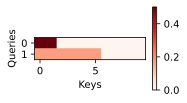

```python
import math
import torch
from torch import nn
from d2l import torch as d2l
```

# 掩码softmax操作


```python
#@save
def masked_softmax(X, valid_lens):
    """通过在最后一个轴上掩蔽元素来执行softmax操作"""
    # X:3D张量，valid_lens:1D或2D张量
    if valid_lens is None:
        return nn.functional.softmax(X, dim=-1)
    else:
        shape = X.shape
        if valid_lens.dim() == 1:
            valid_lens = torch.repeat_interleave(valid_lens, shape[1])
        else:
            valid_lens = valid_lens.reshape(-1)
        # 最后一轴上被掩蔽的元素使用一个非常大的负值替换，从而其softmax输出为0
        X = sequence_mask(X.reshape(-1, shape[-1]), valid_lens,
                              value=-1e6)
        return nn.functional.softmax(X.reshape(shape), dim=-1)

# 抽出d2l中的sequence_mask函数，看看源码构造
def sequence_mask(X, valid_len, value=0):
    """在序列中屏蔽不相关的项"""
    maxlen = X.size(1) 
    mask = torch.arange((maxlen), dtype=torch.float32,
                        device=X.device)[None, :] < valid_len[:, None]
    X[~mask] = value
    return X
```


```python
masked_softmax(torch.rand(2, 2, 4), torch.tensor([2, 3]))
```


    tensor([[[0.4759, 0.5241, 0.0000, 0.0000],
             [0.5050, 0.4950, 0.0000, 0.0000]],
    
            [[0.3616, 0.3200, 0.3184, 0.0000],
             [0.3924, 0.3476, 0.2600, 0.0000]]])

## 细细看看sequence_mask()的源码构造

`tmp[None, :]`是将`tmp`张量增加一个维度，使其形状从一维变为二维。`valid_len[:, None]`是将`valid_len`张量的最后一个维度增加一个轴，使其形状从一维变为二维。

`<`操作符是在进行元素级别的比较。由于`tmp[None, :]`和`valid_len[:, None]`的形状不同，所以这里会进行广播操作。广播操作会自动扩展张量的形状，使得两个张量可以进行元素级别的比较。

这段代码的结果是一个布尔型的张量，其形状与广播后的张量相同。如果`tmp[None, :]`中的某个元素小于`valid_len[:, None]`中的对应元素，那么结果张量中的对应位置就为True，否则为False。

`~`是给矩阵内的bool变量取反，即True变False，False变True。

具体可以看下面的示例代码


```python
x = torch.arange(10).reshape((2, 5))
maxlen = x.size(1)
valid_len = torch.tensor([2, 3])
tmp = torch.arange((maxlen), dtype=torch.float32,
                        device=x.device)
print(tmp)
tmp = tmp[None, :] < valid_len[:, None]
print(tmp)
print(~tmp)
```

    tensor([0., 1., 2., 3., 4.])
    tensor([[ True,  True, False, False, False],
            [ True,  True,  True, False, False]])
    tensor([[False, False,  True,  True,  True],
            [False, False, False,  True,  True]])


# 加性注意力

一般来说，当查询和键是不同长度的矢量时，可以使用加性注意力作为评分函数。给定查询$\mathbf{q} \in \mathbb{R}^q$和键$\mathbf{k} \in \mathbb{R}^k$，*加性注意力*（additive attention）的评分函数为：

$$
a(\mathbf q, \mathbf k) = \mathbf w_v^\top \text{tanh}(\mathbf W_q\mathbf q + \mathbf W_k \mathbf k) \in \mathbb{R}
$$
其中可学习的参数是$\mathbf W_q\in\mathbb R^{h\times q}$、$\mathbf W_k\in\mathbb R^{h\times k}$和$\mathbf w_v\in\mathbb R^{h}$。在维度扩展后

- `queries`的形状：(`batch_size`，查询的个数，1，`num_hidden`)
- `key`的形状：(`batch_size`，1，“键－值”对的个数，`num_hiddens`)

使用广播方式进行求和, 不熟悉广播的同学可以去看`numpy`广播


```python
#@save
class AdditiveAttention(nn.Module):
    """加性注意力"""
    def __init__(self, key_size, query_size, num_hiddens, dropout, **kwargs):
        super(AdditiveAttention, self).__init__(**kwargs)
        self.W_k = nn.Linear(key_size, num_hiddens, bias=False)
        self.W_q = nn.Linear(query_size, num_hiddens, bias=False)
        self.w_v = nn.Linear(num_hiddens, 1, bias=False)
        self.dropout = nn.Dropout(dropout)

    def forward(self, queries, keys, values, valid_lens):
        queries, keys = self.W_q(queries), self.W_k(keys)
        # 在维度扩展后，
        # queries的形状：(batch_size，查询的个数，1，num_hidden)
        # key的形状：(batch_size，1，“键－值”对的个数，num_hiddens)
        # 使用广播方式进行求和
        features = queries.unsqueeze(2) + keys.unsqueeze(1)  # 此时feature的形状为(batch_size，查询的个数，“键－值”对的个数，num_hiddens)
        features = torch.tanh(features) # 经过激活函数后，形状不变
        # self.w_v仅有一个输出，因此从形状中移除最后那个维度。
        # scores的形状：(batch_size，查询的个数，“键-值”对的个数)
        scores = self.w_v(features).squeeze(-1)  # 经过w_v后，形状为(batch_size，查询的个数，“键-值”对的个数，1)，然后去掉最后一个维度
        self.attention_weights = masked_softmax(scores, valid_lens)
        # values的形状：(batch_size，“键－值”对的个数，值的维度)
        return torch.bmm(self.dropout(self.attention_weights), values)
```


```python
queries, keys = torch.normal(0, 1, (2, 1, 20)), torch.ones((2, 10, 2))
# values的小批量，两个值矩阵是相同的
values = torch.arange(40, dtype=torch.float32).reshape(1, 10, 4).repeat(
    2, 1, 1)
valid_lens = torch.tensor([2, 6])
```


```python
attention = AdditiveAttention(key_size=2, query_size=20, num_hiddens=8,
                              dropout=0.1)
attention.eval()
attention(queries, keys, values, valid_lens).shape
```


    torch.Size([2, 1, 4])


```python
d2l.show_heatmaps(attention.attention_weights.reshape((1, 1, 2, 10)),
                  xlabel='Keys', ylabel='Queries')
```



    


## 缩放点积注意力

这个没什么好说的，看公式就可以理解~ 缩放点积注意力（`scaled dot-product attention`）评分函数为：
$$
a(\mathbf q, \mathbf k) = \mathbf{q}^\top \mathbf{k}  /\sqrt{d}
$$
查询$\mathbf Q\in\mathbb R^{n\times d}$、键$\mathbf K\in\mathbb R^{m\times d}$和值$\mathbf V\in\mathbb R^{m\times v}$的缩放点积注意力是：
$$
\mathrm{softmax}\left(\frac{\mathbf Q \mathbf K^\top }{\sqrt{d}}\right) \mathbf V \in \mathbb{R}^{n\times v}
$$


```python
#@save
class DotProductAttention(nn.Module):
    """缩放点积注意力"""
    def __init__(self, dropout, **kwargs):
        super(DotProductAttention, self).__init__(**kwargs)
        self.dropout = nn.Dropout(dropout)

    # queries的形状：(batch_size，查询的个数，d)
    # keys的形状：(batch_size，“键－值”对的个数，d)
    # values的形状：(batch_size，“键－值”对的个数，值的维度)
    # valid_lens的形状:(batch_size，)或者(batch_size，查询的个数)
    def forward(self, queries, keys, values, valid_lens=None):
        d = queries.shape[-1]
        # 设置transpose_b=True为了交换keys的最后两个维度
        scores = torch.bmm(queries, keys.transpose(1,2)) / math.sqrt(d)
        self.attention_weights = masked_softmax(scores, valid_lens)
        return torch.bmm(self.dropout(self.attention_weights), values)
```


```python
queries = torch.normal(0, 1, (2, 1, 2))
attention = DotProductAttention(dropout=0.5)
attention.eval()
attention(queries, keys, values, valid_lens)
```


    tensor([[[ 2.0000,  3.0000,  4.0000,  5.0000]],
    
            [[10.0000, 11.0000, 12.0000, 13.0000]]])


```python
d2l.show_heatmaps(attention.attention_weights.reshape((1, 1, 2, 10)),
                  xlabel='Keys', ylabel='Queries')
```


    

