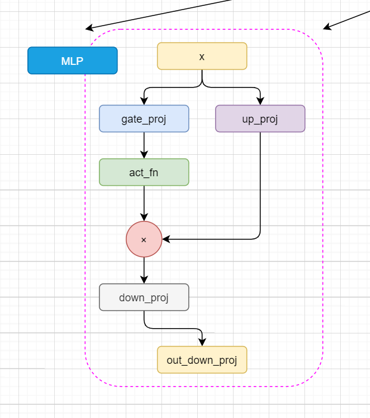

# Llama-Model

在transformers仓库中可以看到llama的源码，首先是LlamaModel类，继承自PreTrainedModel，这个类是所有模型的基类，包含了一些通用的方法，比如保存模型、加载模型、初始化权重等。

继承关系为：`LlamaModel` -> `LlamaPreTrainedModel` -> `PreTrainedModel`

## LlamaConfig

LlamaConfig 中主要是定义一些参数，比如vocab_size、hidden_size、num_hidden_layers、num_attention_heads等。所有的参数有默认值，可以直接创建cofing就能用。

```python
config = LlamaConfig()
```

# LlamaModel


## LlamaModel 初始化

- 设置了模型的两个属性:padding_idx（用于指定填充标记的索引），vocab_size（词汇表的大小）
- 初始化了模型的嵌入层、解码器层、归一化层
- 嵌入层（nn.Embedding）：模型使用嵌入层将输入的标记映射成密集的向量表示。
- 解码器层（nn.ModuleList()）：模型包含多个解码器层，这些层都是由 LlamDecoderLayer 定义
- 归一化层 LlamaRMSNorm：归一化层使用的是 Root Mean Square Layer Normalization（RMS Layer Norm）
- 设置了是否使用 gradient_checkpoint 主要是用来节省显存
- 调用 post_init() 完成一些初始化和准备检查的代码

```python
def __init__(self, config: LlamaConfig):
    super().__init__(config)
    self.padding_idx = config.pad_token_id
    self.vocab_size = config.vocab_size

    # embedding 层
    self.embed_tokens = nn.Embedding(config.vocab_size, config.hidden_size, self.padding_idx)
    # 中间的一堆 decoderlayers 层
    self.layers = nn.ModuleList(
        [LlamaDecoderLayer(config, layer_idx) for layer_idx in range(config.num_hidden_layers)]
    )
    self._use_sdpa = config._attn_implementation == "sdpa"
    self._use_flash_attention_2 = config._attn_implementation == "flash_attention_2"
    self.norm = LlamaRMSNorm(config.hidden_size, eps=config.rms_norm_eps)

    self.gradient_checkpointing = False
    # Initialize weights and apply final processing
    self.post_init()
```

可以看一下 `post_init()` 的代码，主要是初始化权重和`gradient_checkpointing`相关的一些事情。该方法在`PreTrainedModel`基类中，`transformers`中所有模型基本都继承这个类。
    
```python
def post_init(self):
    """
    A method executed at the end of each Transformer model initialization, to execute code that needs the model's
    modules properly initialized (such as weight initialization).
    """
    self.init_weights()
    self._backward_compatibility_gradient_checkpointing()
```

## LlamaModel forward

forward 部分的代码有点长，但其实大部分都是张量并行或者是节省显存相关的代码，对于理解模型结构来说可以直接忽略。

首先进来就是把 `inputs_ids` 进行向量化，然后拿到 `hidden_states` 。 然后是存起来所有的`hidden_states` 进入 `decoder_layer` 再拿一个 `hidden_states`，作为下一轮 `decoder_layer` 的 `hidden_states` 输入，最后给 `hidden_states` norm一下。 如下代码所示：

```python
inputs_embeds = self.embed_tokens(input_ids)
hidden_states = inputs_embeds

for decoder_layer in self.layers:
    # 存起来所有的 hidden_states
    if output_hidden_states:
        all_hidden_states += (hidden_states,)
    # 这里是 decoder_layer 的 forward
    layer_outputs = decoder_layer(
        hidden_states,
        attention_mask=attention_mask,
        position_ids=position_ids,
        past_key_value=past_key_values,
        output_attentions=output_attentions,
        use_cache=use_cache,
    )
    # 再拿一个 hidden_states，作为下一轮 decoder_layer 的 hidden_states 输入
    hidden_states = layer_outputs[0]

hidden_states = self.norm(hidden_states)
```

最后就是以 `BaseModelOutputWithPast` 的形式输出。ok，接下来继续看`decoder_layer`中的其他代码。

# LlamaDecoderLayer

Embedding层不用多说，用的就是torch中的nn.Embedding。那就直接来看DecoderLayer。


## DecoderLayers 初始化

先来看初始化。

- `hidden_size` : 也就是在上面说的输入输出。
- `self_attn` : 别看它写这么多啊，其实就是选一下用什么 `attention` 。看见大写字母不要怕，直接点进去看看怎么个事！
  
    ```python
    LLAMA_ATTENTION_CLASSES = {
        "eager": LlamaAttention,
        "flash_attention_2": LlamaFlashAttention2,
        "sdpa": LlamaSdpaAttention,
    }
    ```
- `mlp` : 一个全连接层 `LlamaMLP` 这个待会后面再说，输入输出都是 `hidden_size` 大小。
- `input_layernorm` : `LlamaRMSNorm` 层，输入时候的norm
- `post_attention_layernorm` : 丢入 `mlp` 之前的操作。

```python
class LlamaDecoderLayer(nn.Module):
    def __init__(self, config: LlamaConfig, layer_idx: int):
        super().__init__()
        self.hidden_size = config.hidden_size

        self.self_attn = LLAMA_ATTENTION_CLASSES[config._attn_implementation](config=config, layer_idx=layer_idx)

        self.mlp = LlamaMLP(config)
        self.input_layernorm = LlamaRMSNorm(config.hidden_size, eps=config.rms_norm_eps)
        self.post_attention_layernorm = LlamaRMSNorm(config.hidden_size, eps=config.rms_norm_eps)\
```

## DecoderLayers forward

首先复制一份 `hidden_states` 给 `residual`。然后 `hidden_states` 进入 `input_layernorm` 进行norm。然后进入 `self_attn` 进行 `attention` 操作，拿到 `hidden_states`、`self_attn_weights`、`present_key_value`。然后 `hidden_states` 和 `residual` 相加，得到 `hidden_states`。

然后 `hidden_states` 进入 `post_attention_layernorm` 进行norm。最后 `hidden_states` 进入 `mlp` 进行全连接操作，拿到 `hidden_states`。然后 `hidden_states` 和 `residual` 相加，得到 `hidden_states`。最后输出 `hidden_states`。

```python
residual = hidden_states

hidden_states = self.input_layernorm(hidden_states)

# Self Attention
hidden_states, self_attn_weights, present_key_value = self.self_attn(
    hidden_states=hidden_states,
    attention_mask=attention_mask,
    position_ids=position_ids,
    past_key_value=past_key_value,
    output_attentions=output_attentions,
    use_cache=use_cache,
    **kwargs,
)
hidden_states = residual + hidden_states

# Fully Connected
residual = hidden_states
hidden_states = self.post_attention_layernorm(hidden_states)
hidden_states = self.mlp(hidden_states)
hidden_states = residual + hidden_states

outputs = (hidden_states,)

if output_attentions:
    outputs += (self_attn_weights,)

if use_cache:
    outputs += (present_key_value,)

return outputs
```

# Llama Attention


看代码首先映入眼帘的就是  ***Attention Is All You Need***  好好好，很有精神！那我们接着往下看。

先来看 init 部分叭。

- `layer_idx` : 这个就是第几个 `DecoderLayers` 层。不用关心。
- `attention_dropout` : 用于dropout的概率。
- `hidden_size` : 输入输出大小。
- `num_attention_heads` : 多头注意力的头数。
- `head_dim` : 多头注意力的维度 `self.hidden_size // self.num_heads`，和transformers中的一样。
- `num_key_value_heads` : 用于key和value的头数。

其他的参数都在 `LlamaConfig` 中有默认值，可以直接使用，也可以直接去`LlamaConfig`的源码中看具体的解释，这里就不再多说。

再往下就是 `q_proj`、 `k_proj` 、`v_proj`、 `o_proj` 四个矩阵（全连接层），耳熟能详了。

```python
class LlamaAttention(nn.Module):
    """Multi-headed attention from 'Attention Is All You Need' paper"""

    def __init__(self, config: LlamaConfig, layer_idx: Optional[int] = None):
        super().__init__()
        self.config = config
        self.layer_idx = layer_idx
        if layer_idx is None:
            logger.warning_once(
                f"Instantiating {self.__class__.__name__} without passing `layer_idx` is not recommended and will "
                "to errors during the forward call, if caching is used. Please make sure to provide a `layer_idx` "
                "when creating this class."
            )

        self.attention_dropout = config.attention_dropout
        self.hidden_size = config.hidden_size
        self.num_heads = config.num_attention_heads
        self.head_dim = self.hidden_size // self.num_heads
        self.num_key_value_heads = config.num_key_value_heads
        self.num_key_value_groups = self.num_heads // self.num_key_value_heads
        self.max_position_embeddings = config.max_position_embeddings
        self.rope_theta = config.rope_theta
        self.is_causal = True

        if (self.head_dim * self.num_heads) != self.hidden_size:
            raise ValueError(
                f"hidden_size must be divisible by num_heads (got `hidden_size`: {self.hidden_size}"
                f" and `num_heads`: {self.num_heads})."
            )

        self.q_proj = nn.Linear(self.hidden_size, self.num_heads * self.head_dim, bias=config.attention_bias)
        self.k_proj = nn.Linear(self.hidden_size, self.num_key_value_heads * self.head_dim, bias=config.attention_bias)
        self.v_proj = nn.Linear(self.hidden_size, self.num_key_value_heads * self.head_dim, bias=config.attention_bias)
        self.o_proj = nn.Linear(self.num_heads * self.head_dim, self.hidden_size, bias=config.attention_bias)
        self._init_rope()
```

## LlamaAttention forward

重头戏来了，`attention forward` 部分。

> 注意：其中有关于张量并行或者显存节省的部分我就直接省略了，直接看主要代码。这个笔记主要是分析llama的模型结构，并不讨论如何节省显存。

首先拿到 `hidden_states` 的 `batch_size` 和 `seq_len` 。然后把 `hidden_states` 丢入 `q_proj`、 `k_proj` 、`v_proj` 三个矩阵（全连接层），拿到 `query_states`、 `key_states` 、`value_states` 。然后把 `query_states`、 `key_states` 、`value_states` reshape 为下一步计算做准备。

将旋转位置嵌入应用于查询和键张量。使用了旋转位置嵌入的余弦和正弦部分，将它们与查询和键张量相乘，并将结果相加，从而实现旋转位置嵌入的效果

`key_states`和`value_states`重复`self.num_key_value_groups`次。然后，使用`torch.matmul()`函数计算`query_states`和转置后的`key_states`之间的矩阵乘法。最后，将结果除以`math.sqrt(self.head_dim)`进行归一化

然后 `attn_weights` 加上 `attention_mask`，再 `softmax` 和 `dropout`。然后 `attn_weights` 和 `value_states` 相乘，把 `attn_output` reshape 为下一步计算做准备，最后把 `attn_output` 丢入 `o_proj` ，然后`return`就行了。

好了，至此。我觉得`llama`最激动人心的地方已经结束了。

```python
# 获取 batch_size 和 seq_len
bsz, q_len, _ = hidden_states.size()

# 把 hidden_states 丢入 q_proj、k_proj、v_proj
query_states = self.q_proj(hidden_states)
key_states = self.k_proj(hidden_states)
value_states = self.v_proj(hidden_states)

# 把 q_proj、k_proj、v_proj 的输出 reshape 为下一步计算做准备
query_states = query_states.view(bsz, q_len, self.num_heads, self.head_dim).transpose(1, 2)
key_states = key_states.view(bsz, q_len, self.num_key_value_heads, self.head_dim).transpose(1, 2)
value_states = value_states.view(bsz, q_len, self.num_key_value_heads, self.head_dim).transpose(1, 2)

# 将旋转位置嵌入应用于查询和键张量。使用了旋转位置嵌入的余弦和正弦部分，将它们与查询和键张量相乘，并将结果相加，从而实现旋转位置嵌入的效果
cos, sin = self.rotary_emb(value_states, seq_len=kv_seq_len)
query_states, key_states = apply_rotary_pos_emb(query_states, key_states, cos, sin, position_ids)

# 首先，它将key_states和value_states重复self.num_key_value_groups次。然后，使用torch.matmul()函数计算query_states和转置后的key_states之间的矩阵乘法。最后，将结果除以math.sqrt(self.head_dim)进行归一化
key_states = repeat_kv(key_states, self.num_key_value_groups)
value_states = repeat_kv(value_states, self.num_key_value_groups)
attn_weights = torch.matmul(query_states, key_states.transpose(2, 3)) / math.sqrt(self.head_dim)

# 然后 attn_weights 加上 attention_mask
attn_weights = attn_weights + attention_mask

# softmax + dropout
attn_weights = nn.functional.softmax(attn_weights, dim=-1, dtype=torch.float32).to(query_states.dtype)
attn_weights = nn.functional.dropout(attn_weights, p=self.attention_dropout, training=self.training)

# 然后 attn_weights 和 value_states 相乘
attn_output = torch.matmul(attn_weights, value_states)

# 然后把 attn_output reshape 为下一步计算做准备
attn_output = attn_output.transpose(1, 2).contiguous()
attn_output = attn_output.reshape(bsz, q_len, self.hidden_size)

# 最后把 attn_output 丢入 o_proj
attn_output = self.o_proj(attn_output)

# 返回 attn_output、attn_weights、present_key_value
return attn_output, attn_weights, past_key_value
```

# LlamaMLP



看完 attention 再看 MLP ，突然就觉得好简单了，哈哈哈。这部分代码比较少，就直接放到一起了。

x进来之后先进去up_proj和gate_proj，gate_proj进行激活，然后这俩再乘起来，丢进 down_proj。 那直接放个图叭，这个过程有点简单了。

```python
class LlamaMLP(nn.Module):
    def __init__(self, config):
        super().__init__()
        # 这俩不必多说
        self.config = config
        self.hidden_size = config.hidden_size
        self.intermediate_size = config.intermediate_size

        # 三个全连接层
        self.gate_proj = nn.Linear(self.hidden_size, self.intermediate_size, bias=False)
        self.up_proj = nn.Linear(self.hidden_size, self.intermediate_size, bias=False)
        self.down_proj = nn.Linear(self.intermediate_size, self.hidden_size, bias=False)
        self.act_fn = ACT2FN[config.hidden_act]

    def forward(self, x):
        down_proj = self.down_proj(self.act_fn(self.gate_proj(x)) * self.up_proj(x))
        return down_proj
```

# LlamaRMSNorm

RMSNorm函数可以用以下数学公式表示：

$$
\text{RMSNorm}(x) = \frac{x}{\sqrt{\frac{1}{n}\sum_{i=1}^{n}w_i^2 + \epsilon}}
$$

其中：
- \( $x$ \) 是层的输入。
- \( $w_i$ \) 代表层的权重。
- \( $n$ \) 是权重的数量。
- \( $\epsilon$ \) 是一个小常数，用于数值稳定性（以避免除以零的情况）。

这种归一化有助于通过确保权重的规模不会变得过大或过小来稳定学习过程，这在具有许多层的深度学习模型中特别有用。

```python
class LlamaRMSNorm(nn.Module):
    def __init__(self, hidden_size, eps=1e-6):
        """
        LlamaRMSNorm is equivalent to T5LayerNorm
        """
        super().__init__()
        self.weight = nn.Parameter(torch.ones(hidden_size))
        self.variance_epsilon = eps

    def forward(self, hidden_states):
        input_dtype = hidden_states.dtype
        hidden_states = hidden_states.to(torch.float32)
        variance = hidden_states.pow(2).mean(-1, keepdim=True)
        hidden_states = hidden_states * torch.rsqrt(variance + self.variance_epsilon)
        return self.weight * hidden_states.to(input_dtype)
```

> 参考：[B站UP良睦路程序员-transformers源码阅读](https://space.bilibili.com/45156039)